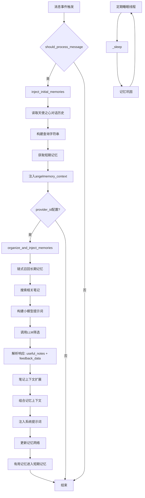

# DeepMind业务流程

## 核心论断

DeepMind实现「双层认知架构」：潜意识层负责记忆筛选，意识层负责决策执行。整个流程围绕「观察-回忆-反馈-睡眠」四阶段循环展开。

## 业务流程图



## 四阶段详解

### 观察阶段：事件驱动记忆召回

**触发条件**：消息长度≥5字符，非指令消息（不以/开头）

**核心动作**：
- 提取天使之心「对话历史」
- 构建「查询字符串」作为回忆线索
- 读取「短期记忆」供其他模块参考

**输出**：angelmemory_context = {memories, recall_query, user_list}

### 回忆阶段：潜意识筛选记忆

**触发条件**：配置了provider_id，且存在angelmemory_context

**潜意识筛选流程**：
1. 「链式召回」：从长期记忆检索7条相关记忆
2. 「笔记搜索」：基于核心话题或查询字符串搜索候选笔记
3. 「小模型决策」：调用LLM选择有用笔记和记忆
4. 「上下文扩展」：对选中笔记进行上下文补充

**记忆注入格式**：
```
[潜意识记忆片段]
{FIFO记忆内容}

---

相关笔记上下文：
{扩展后的笔记内容}
```

### 反馈阶段：记忆网络更新

**更新类型**：
- 「权重更新」：提升有用记忆强度
- 「新增记忆」：创建新的记忆节点
- 「记忆合并」：将相关记忆合并成群组

**短期记忆更新**：潜意识筛选出的有用记忆进入FIFO队列

### 睡眠阶段：定期记忆巩固

**触发机制**：独立线程，默认间隔3600秒

**巩固内容**：调用memory_system.consolidate_memories()优化记忆网络结构

## 关键技术点

### 双层认知架构

**潜意识层**（llm_memory子系统）：
- 负责记忆存储、索引、关联
- 实现链式召回算法
- 管理长期记忆网络

**意识层**（DeepMind）：
- 处理会话级记忆管理
- 执行记忆筛选逻辑
- 响应用户事件

### 记忆筛选机制

**查询构建**：基于对话历史生成回忆线索
**多模态召回**：同时检索记忆和笔记
**LLM筛选**：用小模型选择最相关的信息
**上下文扩展**：对选中内容进行语义补充

### 错误容忍设计

**隔离机制**：记忆系统异常不影响主流程
**降级处理**：provider_id为空时跳过记忆整理
**日志追踪**：详细记录每个决策点

## 数据流分析

### 输入数据源
- 天使之心上下文（对话历史、secretary决策）
- 用户消息内容
- 长期记忆库
- 笔记系统

### 输出数据流
- 系统提示词注入
- 短期记忆更新
- 长期记忆权重调整
- 新记忆创建

### 状态管理
- session_memory_manager：维护会话级FIFO记忆
- angelmemory_context：跨模块传递记忆上下文
- memory_feedback：记录LLM筛选结果

## 性能优化点

### Token预算控制
- 小模型笔记预算：small_model_note_budget
- 大模型笔记预算：large_model_note_budget
- 记忆数量限制：per_type_limit=7

### 异步处理
- 记忆巩固在独立线程执行
- LLM调用使用async/await
- 错误处理不阻塞主流程

### 缓存策略
- 短期记忆减少重复召回
- 笔记ID映射缓存避免重复计算
- 查询字符串复用减少处理开销