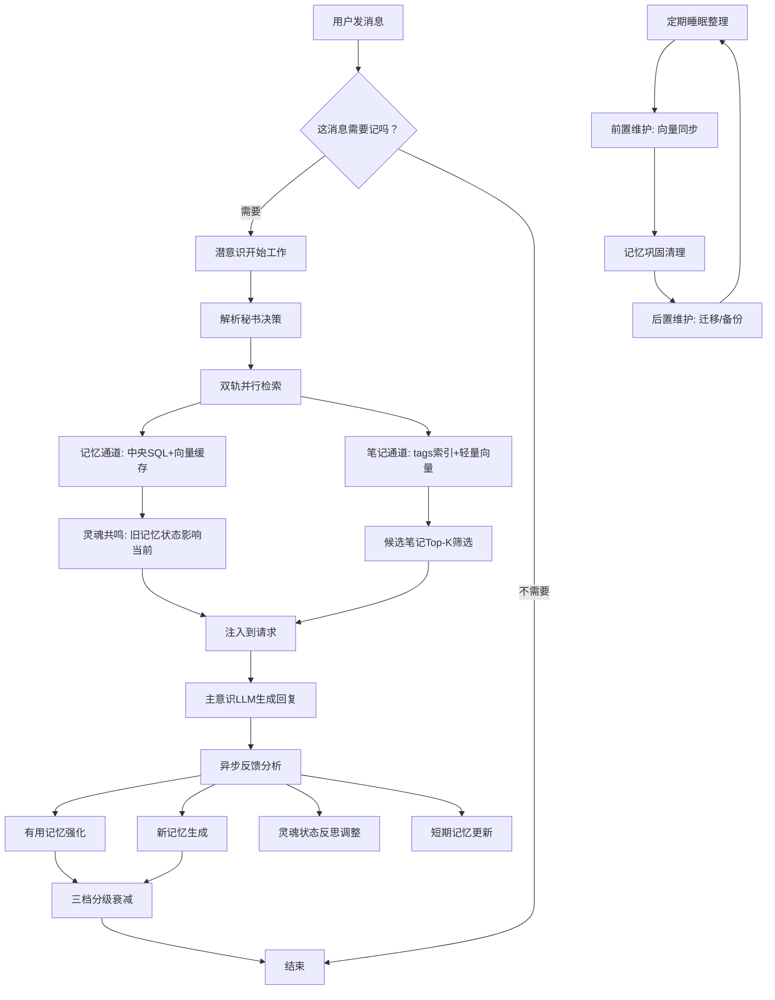

# DeepMind潜意识业务流程

## 核心论断

DeepMind就是AI的**潜意识系统**，配合**主意识（LLM）**实现双层认知架构：
- **DeepMind（潜意识）**：在后台默默管理记忆、筛选信息、整理知识、调节精神状态
- **主意识（LLM）**：负责和你正常聊天、思考问题、做决策

整个流程围绕「观察-回忆-反馈-睡眠」四阶段循环，就像人睡觉时整理记忆一样。

## 业务流程图



## 四阶段详解

### 观察阶段：AI开始注意你说话

**什么时候启动**：
- 消息超过配置的最小长度（默认5个字）
- 不是命令（不以/开头）
- 是正常聊天内容

**AI做什么**：
- 从`angelheart_context`中提取秘书决策（topic、entities、facts、keywords）
- 构建查询字符串用于后续检索
- 准备记忆包 {之前的记忆, 搜索关键词, 参与人员}

**产出**：准备好检索所需的查询上下文

### 回忆阶段：双轨并行 + 灵魂共鸣

**什么时候启动**：
- 你配置了AI助手（provider_id）
- 有记忆包准备好了

**潜意识的做事流程**：

1. **双轨并行检索**：同时启动记忆通道和笔记通道
   - **记忆通道**：中央SQL索引作为真相源 + 向量库作为检索缓存
   - **笔记通道**：tags索引 + notes_index轻量向量索引

2. **灵魂共鸣机制**：
   - 检索到的记忆携带`state_snapshot`（创建时的灵魂状态快照）
   - 当前灵魂状态与旧记忆快照产生共鸣
   - 共鸣会微调当前状态，产生"情绪惯性"

3. **动态参数控制**：
   - `RecallDepth`：控制检索数量上限
   - 灵魂能量值通过橡皮筋算法映射到物理参数

**记忆喂给主意识的格式**：
```
<system_context>
<instruction>
以下是系统自动检索的背景上下文...
</instruction>

<soul_state>
• 社交倾向: 内向 ████████   外向 [0.75]
• 认知倾向: 指导 ████       好奇 [0.42]
• 表达倾向: 简洁 ██████     详尽 [0.58]
• 情绪倾向: 严肃 ███████    活泼 [0.85]
</soul_state>

<memories>
[短期记忆内容]
</memories>

<notes>
[笔记上下文]
</notes>
</system_context>
```

### 反馈阶段：让记忆变得更强 + 灵魂反思

**异步分析流程**：
- 主LLM回复后，异步提交分析任务到后台队列
- 小模型分析对话，输出结构化反馈

**AI怎么更新记忆**：
- **强化好记忆**：有用的记忆增加`useful_score`
- **记新东西**：重要的信息变成新记忆（受`ImpressionDepth`限制）
- **合并相似记忆**：把重复的内容整理成更精炼的记忆
- **三档分级衰减**：根据`useful_score`自动分档（T0/T1/T2）

**灵魂状态反思**：
- 小模型输出4位状态代码（如`1011`）
- 每一位对应一个维度的增减方向
- 使用`adjust(code, mode="reflect")`原子化调整

**短期记忆更新**：筛选出的好记忆 + 新创建的记忆进入短期缓存

### 睡眠阶段：AI定期睡觉整理

**什么时候睡觉**：后台定时器，默认每小时睡一次

**睡眠维护管线**：

```
前置维护 → 记忆巩固 → 后置维护
```

**前置维护（pre_consolidate）**：
- 向量到中央迁移：确保向量库数据回灌到中央SQL
- 记忆向量同步：同步中央SQL到向量索引

**记忆巩固（consolidate_memories）**：
- 执行三档分级衰减算法
- 清理过期记忆
- 合并相似记忆

**后置维护（post_consolidate）**：
- memory_scope补齐迁移
- 废弃字段清理
- 笔记向量库同步（增量/全量重建）
- 每日JSON备份（保留最近3份）

## 核心架构

### 中央索引真相源

**设计原则**：
- 中央SQL索引是唯一真相源
- 向量库收敛为检索缓存，不承载主数据语义
- 支持无向量模式（SimpleMemoryRuntime）

**优势**：
- 数据一致性有保障
- 存储体积明显下降
- 支持无向量模式下的可用检索路径

### 灵魂状态系统

**四维能量槽**：
| 维度 | 作用 | 默认值 | 范围 |
|------|------|--------|------|
| RecallDepth | 检索数量上限 | 7 | 1-20 |
| ImpressionDepth | 新记忆生成上限 | 3 | 1-10 |
| ExpressionDesire | 发言长度倾向 | 0.5 | 0-1 |
| Creativity | 思维发散倾向 | 0.7 | 0-1 |

**橡皮筋算法**：
- 能量值倾向回归mid（默认值）
- 离mid越远越难继续偏离（弹性阻力）
- 公式：`y = mid + (max - mid) * tanh(k * x)`

**双轨调整**：
- **主动反思（reflect）**：强度1.0，对话后主动调整
- **被动共鸣（resonate）**：强度0.3，旧记忆影响当前状态

### 三档分级遗忘（TMD）

**分档规则**：
| 档位 | 条件 | 特点 | 年驱散率 |
|------|------|------|----------|
| T0 易逝档 | useful_score < 3 | 噪声记忆，快速衰减 | ~95% |
| T1 待证档 | 3 ≤ useful_score < 10 | 待验证记忆，中速衰减 | ~60% |
| T2 核心档 | useful_score ≥ 10 | 重要记忆，慢速衰减 | ~20% |

**衰减时机**：
- 反馈阶段：区分"被召回且有用"与"被召回但无用"
- 睡眠周期：批量执行衰减SQL

### 笔记索引策略

**叶子节点索引**：
- 仅为"没有子标题"的标题节点建索引
- 避免冗余，提升检索精度

**tags索引替代全量向量化**：
- 笔记内容不再全量向量化
- 使用tags + 轻量向量索引
- 大规模笔记场景索引效率显著提升

## 服务拆分架构

DeepMind职责拆分为多个独立服务：

| 服务 | 职责 |
|------|------|
| `RetrievalService` | 记忆/笔记检索、上下文解析 |
| `InjectionService` | 记忆/笔记/灵魂状态注入到请求 |
| `FeedbackService` | 异步反馈分析、记忆更新 |
| `SleepService` | 睡眠调度、维护管线编排 |
| `SleepMaintenanceService` | 具体维护任务执行 |

## 数据流分析

### AI从哪里获取信息
- `angelheart_context`：秘书决策（topic、entities、facts、keywords）
- 中央SQL索引：长期记忆真相源
- 向量库缓存：语义检索加速
- 笔记tags索引：知识库检索

### AI输出什么
- 给主意识的记忆包（通过`extra_user_content_parts`注入）
- 短期记忆缓存更新
- 长期记忆重要性调整（`useful_score`）
- 创建新的重要记忆
- 灵魂状态调整

### AI怎么管理状态
- **session_memory_manager**：管理每段对话的短期记忆
- **angelmemory_context**：在不同模块间传递记忆信息
- **SoulState**：管理四维能量槽状态
- **feedback_queue**：后台异步任务队列

## 性能优化点

### 省钱省时的设计
- **小模型分析**：用便宜的AI快速筛选反馈
- **动态限制**：灵魂参数动态控制检索/生成数量
- **批量SQL**：衰减使用CTE批量执行，避免逐行IO

### 后台干活
- **异步反馈**：不阻塞主对话流程
- **睡眠整理**：定期维护，不影响你聊天
- **增量同步**：笔记向量库按需增量更新

### 缓存提速
- **短期记忆缓存**：常用信息放口袋，随时取用
- **ID映射缓存**：避免重复查找相同内容
- **向量检索缓存**：加速语义检索

## 错误容忍设计

**坏了也不影响聊天**：记忆子系统出问题时，你还能正常和AI聊天

**可以不用**：没配置AI助手时，记忆功能自动关闭，不影响基本使用

**详细记录**：每个步骤都有日志，方便排查问题

**无向量模式**：即使没有向量库，tags检索路径仍然可用
