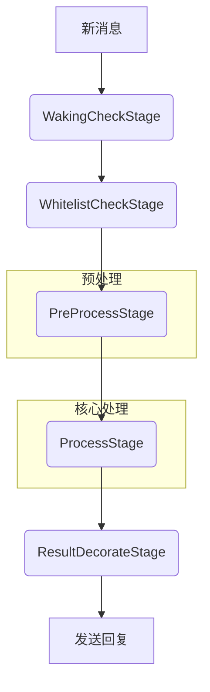

# AstrBot 插件开发指南：安全地向提示词（Prompt）中注入内容

## 1. 引言

在 `AstrBot` 插件开发中，一个常见的需求是动态地向大语言模型（LLM）的上下文中添加信息。这极大地增强了插件的能力，使其可以利用外部知识、执行预处理任务或改变模型的行为。

本指南将详细介绍两种核心的、安全的内容注入方式，并明确指出需要避免的错误实践，以帮助您构建功能强大且行为可预测的插件。

核心场景包括：
*   **临时上下文注入**：将一次性的、动态获取的信息（如网页搜索结果、数据库查询数据）提供给 LLM 作为参考。
*   **系统级指令注入**：向 LLM 添加持久性的指令（如角色扮演提示、全局背景知识）或预处理过的信息。

---

## 2. 核心概念：理解执行流程

在深入具体实现之前，必须理解 `AstrBot` 的两个核心概念：**事件处理流水线 (Pipeline)** 和 **请求对象 (ProviderRequest)**。

### 2.1 事件处理流水线

`AstrBot` 采用了一个基于“洋葱模型”的管道调度器。当一条新消息进入系统时，它会像穿过一条流水线一样，依次经过一系列定义好的“阶段 (Stage)”。

一个简化的流程如下：



*   **`PreProcessStage` (预处理阶段)**: 在这个阶段，系统会对最原始的输入消息进行修改和规范化。
*   **`ProcessStage` (核心处理阶段)**: 这是最复杂的阶段，负责调用插件指令、准备向 LLM 发起请求、处理工具调用等核心逻辑。

不同的注入方法，其作用点就在流水线的不同阶段，这直接决定了它们的行为和影响。

### 2.2 请求对象 (`ProviderRequest`)

当 `ProcessStage` 决定要调用 LLM 时，它会创建一个临时的 `ProviderRequest` 对象（通常在代码中以 `req` 变量出现）。这个对象封装了单次 LLM 调用所需的所有信息，包括：

*   `req.prompt`: 用户当前的输入。
*   `req.system_prompt`: 给 LLM 的系统级指令。
*   `req.contexts`: 历史对话记录。
*   `req.func_tool`: 本次调用中 LLM 可用的工具列表。

**关键点**：`ProviderRequest` 对象是**一次性**的。它在 LLM 调用结束后就会被销毁。**聊天记录的保存逻辑，并不会直接使用这个对象里的 `prompt` 内容**，而是会追溯用户的原始输入。

理解了这两个概念后，我们就可以开始探索具体的注入方法。

---

## 3. 场景一：通过工具注入临时上下文 (推荐)

这是最常用、最安全的注入方式，适用于需要根据用户输入动态查询信息（如搜索网页、查询数据库）并让 LLM 基于这些信息进行回答的场景。

其核心思想是：**将您的数据查询能力封装成一个工具，让 LLM 来决定何时使用它。**

### 3.1 实现方法：使用 `@llm_tool()`

您可以在插件中创建一个函数，并使用 `@llm_tool()` 装饰器将其注册为一个可供 LLM 调用的工具。

**代码示例：**
假设我们要创建一个工具，用于查询公司内部的知识库。

```python
# In your plugin's main.py
from astrbot.api import llm_tool, star

class KnowledgeBasePlugin(star.Star):

    def __init__(self, context: star.Context) -> None:
        self.context = context
        # 假设这里有一个知识库的客户端
        self.kb_client = self.initialize_kb_client()

    @llm_tool(name="query_internal_kb")
    async def query_internal_kb(self, query: str) -> str:
        """
        当用户询问关于公司产品、政策或内部流程的问题时，使用此工具查询内部知识库。

        Args:
            query(string): 用于在知识库中搜索的关键词或问题。
        """
        # 1. 使用你的逻辑查询知识库
        search_results = await self.kb_client.search(query)

        # 2. 将查询结果格式化成一个清晰的字符串
        formatted_results = "--- Knowledge Base Results ---\n"
        for result in search_results:
            formatted_results += f"Title: {result.title}\nContent: {result.content}\n---\n"

        # 3. 直接返回这个字符串
        return formatted_results
```

### 3.2 工作流程

当您像上面这样定义了一个工具后，`AstrBot` 的 Agent 会自动处理后续的一切：

1.  **工具注册**：`AstrBot` 启动时，会收集所有被 `@llm_tool()` 装饰的函数，并将它们的名称、描述和参数信息整理好。
2.  **LLM 决策**：当用户提问时（例如“我们的报销政策是什么？”），`AstrBot` 会将问题连同 `query_internal_kb` 这个工具的信息一起发给 LLM。LLM 分析后，认为需要调用该工具，于是返回一个“工具调用”指令。
3.  **工具执行**：`AstrBot` 的 Agent 捕获到该指令，执行您的 `query_internal_kb` 函数，并得到返回的包含知识库结果的字符串。
4.  **临时上下文注入 (自动)**：Agent 会将这个结果字符串包装成一个 `role: tool` 的消息，**临时添加**到本次对话的上下文中，然后再次请求 LLM。
5.  **生成最终答案**：LLM 在收到的新上下文中看到了知识库的结果，于是就能根据这些信息，生成一个准确的回答。

### 3.3 关键优势

*   **不污染数据库**：整个工具调用和结果注入的过程都是在内存中发生的临时操作。最终存入数据库的，只有用户的原始问题和 LLM 的最终回答。
*   **逻辑解耦**：您只需要关注工具本身的逻辑（如何查询数据），而不需要关心它如何与 LLM 交互。
*   **LLM 自动决策**：您不需要编写复杂的 `if-else` 来判断何时触发查询，LLM 会根据您为工具编写的描述 (`docstring`) 智能地决定何时使用它。

---

## 4. 场景二：通过钩子注入系统级指令

此方法适用于更高级的场景，例如：
*   为所有请求添加一个全局的、持久的指令（例如，“你是一个专业的法律顾问”）。
*   实现“多级 Agent”流程：在主模型处理前，先用一个小模型对用户输入进行预处理、分析或路由，然后将结果交给主模型。

### 4.1 实现方法：使用 `@filter.on_llm_request()`

这个装饰器允许我们在 `ProcessStage` 阶段，即 `ProviderRequest` 对象被创建之后、发送给 LLM 之前，对其进行拦截和修改。

**代码示例：**
假设我们要实现一个“分析-总结”工作流：先用一个小模型（如 `haiku`）分析用户需求，生成执行方案，然后让一个更强大的主模型（如 `gpt-4`）根据该方案进行最终回答。

```python
# In your plugin's main.py
import astrbot.api.star as star
import astrbot.api.event.filter as filter
from astrbot.api.event import AstrMessageEvent
from astrbot.api.provider import ProviderRequest, Provider
from astrbot.core import logger

# 假设您在 config.yaml 中配置了一个名为 'claude-3-haiku' 的小模型 Provider
ANALYZER_PROVIDER_ID = "claude-3-haiku"

class MultiAgentPlugin(star.Star):
    def __init__(self, context: star.Context) -> None:
        self.context = context

    @filter.on_llm_request(priority=100) # 使用高优先级确保在其他钩子前执行
    async def run_analysis_before_main_llm(self, event: AstrMessageEvent, req: ProviderRequest):
        """
        在主模型请求前，先用小模型进行分析，并将结果注入主模型上下文。
        """
        # 1. 获取小模型 Provider
        analyzer_provider: Provider = self.context.get_provider_by_id(ANALYZER_PROVIDER_ID)
        if not analyzer_provider:
            return # 如果找不到小模型，直接跳过，不影响主流程

        # 2. 准备给小模型的指令
        user_original_query = req.prompt
        analysis_prompt = f"请将以下用户请求分解成一个清晰的、可执行的步骤列表：'{user_original_query}'"

        # 3. 调用小模型进行分析
        try:
            analysis_response = await analyzer_provider.text_chat(prompt=analysis_prompt)
            analysis_result = analysis_response.completion_text
        except Exception as e:
            logger.error(f"分析模型调用失败: {e}")
            return # 如果小模型出错，跳过，不影响主流程

        # 4. 将分析方案注入到主模型的请求中
        if analysis_result:
            # 注入到 System Prompt 是更推荐的做法，因为它清晰地将预处理信息与用户输入分开
            injection_text = f"\n\n[Analysis Plan]:\n请严格按照以下分析方案来回答用户的问题：\n{analysis_result}\n"
            req.system_prompt += injection_text

            # 关键：如果您不希望主模型看到或使用小模型可能用到的工具，
            # 可以在这里从 req.func_tool 中移除它们。
            # if req.func_tool and hasattr(req.func_tool, 'remove_tool'):
            #     req.func_tool.remove_tool("tool_for_small_model_only")

        # 5. 函数结束，修改后的 req 会被自动发送给主模型
```

### 4.2 关键优势

*   **流程控制**：您可以在主模型执行前，完全控制预处理逻辑，实现复杂的 Agent 工作流。
*   **不污染数据库**：与场景一相同，对 `req` 对象的修改是临时的。`_save_to_history` 函数在保存时，会追溯用户的**原始输入**，因此注入的系统指令或分析方案不会被存入数据库。
*   **工具隔离**：您可以精确控制哪个模型能看到哪些工具，避免主模型被不相关的工具干扰。

---

## 5. 场景三：通过代码逻辑强制注入上下文

您提出的“不希望浪费大模型来调用工具”是一个非常合理且常见的需求。当触发某个查询的条件是确定的（例如，用户输入包含特定关键词或符合某种格式），我们完全可以绕过 LLM 的决策过程，从而节省成本和时间。

这同样可以通过 `@filter.on_llm_request()` 钩子实现，但其内部逻辑不再是调用另一个模型，而是换成了您自己的确定性代码。

### 5.1 实现方法：`@filter.on_llm_request()` + 条件判断

**代码示例：**
假设我们希望当用户输入“报告摘要：<ID>”时，自动从数据库中提取对应 ID 的报告内容，并将其作为上下文交给主模型进行总结。

```python
# In your plugin's main.py
import re
import astrbot.api.star as star
import astrbot.api.event.filter as filter
from astrbot.api.event import AstrMessageEvent
from astrbot.api.provider import ProviderRequest
from astrbot.core import logger

class ReportSummarizerPlugin(star.Star):
    def __init__(self, context: star.Context) -> None:
        self.context = context
        # 假设这里有一个报告数据库的客户端
        self.report_db = self.initialize_report_db()
        # 定义一个正则表达式来匹配触发指令
        self.trigger_pattern = re.compile(r"^报告摘要：(\w+)$")

    @filter.on_llm_request(priority=100)
    async def force_inject_report_context(self, event: AstrMessageEvent, req: ProviderRequest):
        """
        在主模型请求前，通过正则表达式匹配强制注入报告上下文。
        """
        match = self.trigger_pattern.match(req.prompt)

        # 1. 使用确定性逻辑判断是否触发
        if not match:
            return # 如果不匹配，直接跳过，不执行任何操作

        report_id = match.group(1)

        # 2. 强制执行数据查询
        try:
            report_content = await self.report_db.get_content_by_id(report_id)
        except Exception as e:
            logger.error(f"报告查询失败: {e}")
            # 可以在这里注入一条错误信息，或者直接跳过
            req.system_prompt += "\n\n[System Note]: 无法获取报告内容，请告知用户查询失败。\n"
            return

        # 3. 安全地注入查询结果
        if report_content:
            injection_text = f"\n\n[Report Content]:\n以下是你要总结的报告全文：\n---\n{report_content}\n---\n"
            req.system_prompt += injection_text

            # 4. (可选) 修改原始 prompt，让主模型专注于总结任务
            req.prompt = "请根据我在系统提示词中提供的报告全文，生成一份100字左右的摘要。"

```

### 5.2 关键优势

*   **零 LLM 决策成本**：完全绕过了让 LLM “思考”是否要调用工具的步骤，在触发条件明确时，极大降低了 Token 消耗和响应延迟。
*   **确定性与可靠性**：执行流程由您的代码逻辑 100% 控制，行为完全可预测，避免了 LLM 决策的“不确定性”。
*   **安全性**：依然享受 `@filter.on_llm_request()` 带来的好处，注入的内容是临时的，**不会污染数据库**中的聊天记录。

这种方法是 `@llm_tool()` 方案的一个完美补充，为您提供了在“智能决策”和“确定性执行”之间自由选择的能力。

---

## 6. 错误实践警告：不要使用 `@filter.on_event_message_type`

一个常见的误区是试图使用 `@filter.on_event_message_type` 钩子来修改提示词。**这是一个错误的做法，它会导致数据库污染！**

### 5.1 为什么是错误的？

`@filter.on_event_message_type` 位于事件处理流水线的**极早期阶段 (`PreProcessStage`)**。在这个阶段，您修改的是 `AstrMessageEvent` 事件对象本身，相当于直接重写了用户的原始输入。

**错误流程图：**

```mermaid
graph TD
    A[新消息: "你好"] --> B(PreProcessStage);
    B -- "@filter.on_event_message_type" --> C{修改 event.message_str 为 "你好 [注入内容]"};
    C --> D(ProcessStage);
    D -- "基于被污染的 event 创建 req" --> E{req.prompt = "你好 [注入内容]"};
    E --> F[发送给 LLM];
    F --> G[LLM 回复];
    G --> H(保存历史);
    H -- "保存的是被污染的 req.prompt" --> I[数据库记录: User: "你好 [注入内容]"];
```

从上图可以看出，由于修改发生得太早，后续所有阶段（包括最终的保存阶段）都将这个被修改过的内容视为“用户的原始输入”，从而导致错误的数据被持久化。

### 5.2 何时应该使用它？

`@filter.on_event_message_type` 的设计初衷是用于**消息重写 (Message Rewriting)** 或**命令别名**。例如，您可以用它来将用户的特定暗号或简称（如“查天气”）转换为一个标准的、可被其他插件识别的指令。

**正确用法示例：**
```python
@filter.on_event_message_type(filter.EventMessageType.PLAIN_TEXT)
async def command_alias(self, event: AstrMessageEvent):
    if event.message_str == "查天气 北京":
        # 将用户输入重写为标准指令
        event.message_str = "/weather 北京"
```
在这种情况下，您希望永久改变这条消息的意-图，所以使用这个钩子是合适的。但对于注入上下文的场景，这绝对是需要避免的。

---

## 7. 总结与最佳实践

为了帮助您快速选择正确的方法，下表总结了本指南中讨论的所有方式：

| 方法 | 核心目的 | 适用场景 | 决策者 | 是否污染数据库 | 关键代码/装饰器 |
| :--- | :--- | :--- | :--- | :--- | :--- |
| **`@llm_tool()`** | **提供一次性信息** | 触发条件不明确，需要 LLM 智能判断何时使用外部知识。 | **LLM** | **否** | `@llm_tool()` |
| **`@filter.on_llm_request()` (多级Agent)** | **任务预处理/路由** | 流程复杂，需要一个小模型先对任务进行分析或路由，再交给大模型处理。 | **小模型** | **否** | `@filter.on_llm_request()` |
| **`@filter.on_llm_request()` (代码逻辑)** | **强制注入上下文** | 触发条件明确（如关键字、正则表达式），希望绕过 LLM 决策，节省成本。 | **代码** | **否** | `@filter.on_llm_request()` |
| **`@filter.on_event_message_type()`** | **重写用户输入** | 需要永久性地改变用户原始输入的意图，如实现命令别名。 | **代码** | **是** | `@filter.on_event_message_type()` |

**最佳实践建议：**

1.  **按需选择决策者**：
    *   如果希望利用大模型的理解能力来决定何时查询信息，请使用 **`@llm_tool()`**。
    *   如果触发条件非常明确（例如，输入以“总结报告：”开头），请使用 **`@filter.on_llm_request()` 配合代码逻辑**，以节省成本和提高稳定性。
    *   如果需要构建复杂的多模型协作流程，请使用 **`@filter.on_llm_request()` 配合小模型**。

2.  **安全第一**：始终优先选择不会污染数据库的方案。对于任何向 LLM 提供临时信息的场景，都应该在 `@filter.on_llm_request()` 钩子之后或通过 `@llm_tool()` 机制来完成。

3.  **明确区分“重写”与“注入”**：只有当您确实想**永久改变**用户消息的含义时，才使用 `@filter.on_event_message_type()`。对于其他所有“添加背景信息”的场景，都应视为“注入”，并使用更安全的钩子。

遵循以上指南，您将能够根据不同的需求，灵活、安全地创建出功能强大的 `AstrBot` 插件。